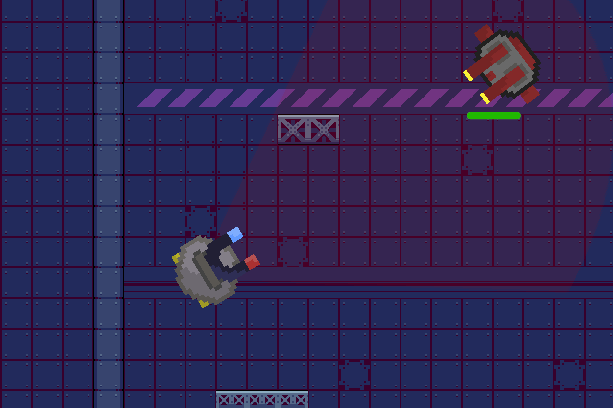

# Magslam

A simple game made in godot where you have to magnetically attract enemies and slam them into eachothers or walls to kill them.  

I just wanted to make a game and brain stormed this idea.  

you can play the game at [here](https://fazalthe.itch.io/magslam).  

---

## How to play

WASD to move around. The red sector shaped area in front of the magnet is the attract area, you can attract enemies within the attract area by pressing left mouse. You need to attract drag also dodge while they come at you while attracting. If they hit you, you also lose hp.  

The goal of the game is to kill as much bots as possible without dying. You could say, If I just stand still I never dies, yeah I am aware. But the point of the game is to kill as much as possible not just survival. I mean like you could stay still in super mario and never die. I might change this in the future, but for now thats all.

---

## Endless Theme

This game falls into the endless theme because as long as you dont lose the game never ends, theoratically you can play this game for infinty.

